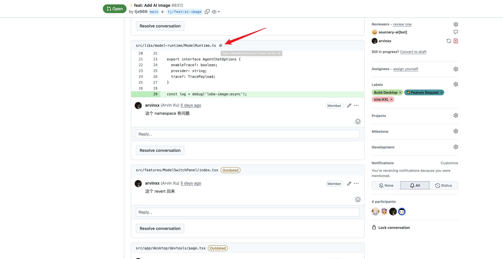

# Browser extension to open GitHub file links in your IDE

## 🚀 Fork 版本更新 (与原版差异)

**注意：这是原项目的 Fork 版本，包含以下额外功能：**

### ✨ 新增 IDE 支持

- **Cursor IDE** - 现已支持最新的 AI 代码编辑器 Cursor

 

### 📦 安装方式 (Fork 版本)

由于这是 Fork 版本，请通过以下方式安装：

1. 访问本仓库的 [`build/`](../../tree/master/build) 文件夹
2. 下载对应浏览器的 `.zip` 文件：
   - Chrome/Edge: 下载 `chrome.zip`
   - Firefox: 下载 `firefox.zip`
3. 解压下载的文件
4. **Chrome/Edge 安装**：
   - 打开 [chrome://extensions/](chrome://extensions/)
   - 启用 "开发者模式"
   - 点击 "加载已解压的扩展程序"
   - 选择解压后的文件夹
5. **Firefox 安装**：
   - 打开 [about:debugging#/runtime/this-firefox](about:debugging#/runtime/this-firefox)
   - 点击 "临时载入附加组件"
   - 选择解压文件夹中的 `manifest.json` 文件

### 📚 更多信息

如需了解原版扩展的详细功能说明、开发指南和完整文档，请访问：
👉 **原版仓库**: <https://github.com/dev-yesman/open-github-links-in-ide>

---
